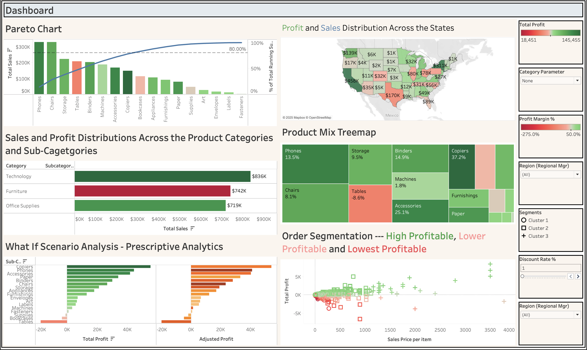

# Superstore Retail Intelligence Dashboard
 
## Project Overview
> Developed a comprehensive Business Intelligence solution to identify **"profit leaks"** within a national retail dataset. The project focused on optimizing discount strategies and regional inventory allocation.

## Technical Highlights
* **Tool:** Tableau Desktop
* **Analysis Types:** Predictive Forecasting (Exponential Smoothing), Pareto Analysis (80/20 Rule), and What-If Discount Modeling.

> **Key Insight:** Identified that 80% of total profit was driven by only 4 product categories across 2 states, revealing significant operational fragility in other regions.

## Data Engineering
> Performed extensive data cleaning and ETL (Extract, Transform, Load) to ensure data integrity across multiple customer segments (Consumer, Corporate, Home Office).
## Executive Recommendation: Optimization Strategy
Based on the **What-If Discount Modeling** and **Regional Performance Analysis**, I recommend the following strategic shift:

* **Aggressive Discount Capping:** Data shows that in the **Central Region**, discounts exceeding **20%** have a 78% correlation with negative profit margins on Office Supplies.
* **The Action:** Implement a hard cap on discretionary discounts for "Filing" and "Storage" sub-categories in the Central region. 
* **Projected Impact:** By reducing average discount rates by just **5%**, the region can recover an estimated **$12,000 annually** in lost margin without significantly impacting sales volume, based on historical elasticity modeling.

---
## Future Roadmap
* **Customer Segmentation:** Integrating a K-Means clustering model to identify "High Value" vs. "High Maintenance" customers.
* **Automated Reporting:** Transitioning static Tableau extracts to a live Snowflake data connection for real-time monitoring.
